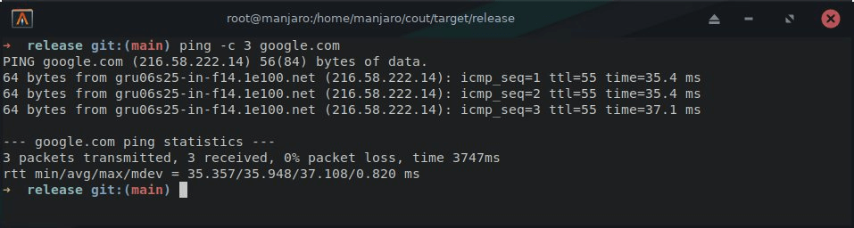
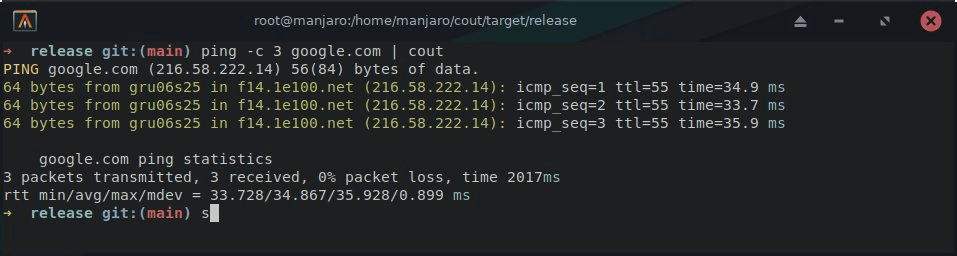
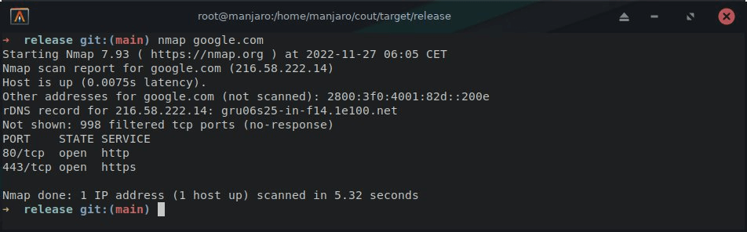
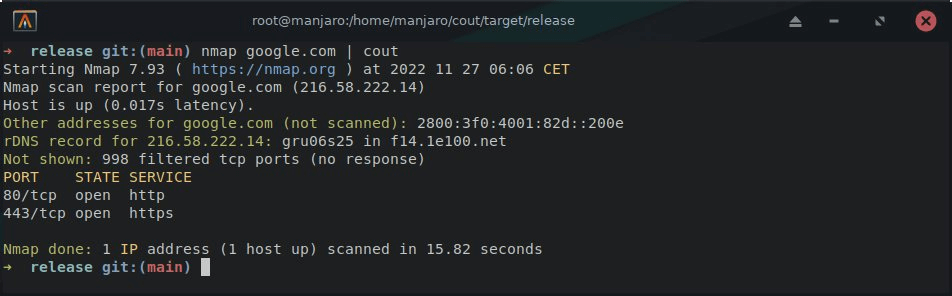

<div align="center">
  
  <h1>COUT - Colored Output</h1>
  <p>A fast and memory-safe stdout colorizer for a general DX better experience.</p>
</div>

<h2>Build</h2>

<p>Build the project with <a href="https://www.rust-lang.org/" target="_blank">Rust</a> and can be built with <b>cargo</b>:

```bash
cargo build --release
```

<p>After the build, the binary will be located in <b>target/release/cout</b>. And for a easier use, you can add the binary to your <b>PATH</b> environment variable.</p>

```bash
export PATH=$PATH:$(pwd)/target/release/cout
```

<h2>Usage</h2>

<p><code>cout</code> can be used with any bash command, just pipe the output to cout and it will colorize it, for example:</p>

```bash
ls -la | cout
nmap google.com | cout
wpscan google.com/wp-login.php | cout
```

<div align="center">
  <h2>Examples</h2>
  <p>Here are some examples of cout usage:</p>

  <h3>- - - Ping - - -</h3>
  
  

  <h3>- - - Nmap - - -</h3>
  
  
</div>

<br/>

> Note: `cout` is not a replacement for the original command, it just colorizes the output in a generic way for a better DX with broader compatibility.

<h2>License</h2>

<p>This project is licensed under the Apache License 2.0 - see the <a href="LICENSE">LICENSE</a> file for details.</p>
