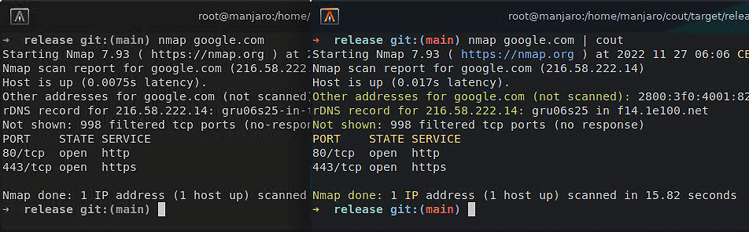

<div align="center">
  
  <h1>🎨 COUT - Colored Output</h1>
  <p>A fast and memory-safe stdout colorizer for a general DX better experience.</p>
  
  
  

</div>

<h2>⚙️ Build</h2>

<p>Build the project with <a href="https://www.rust-lang.org/" target="_blank">Rust</a> and can be built with <b>cargo</b>:

```bash
cargo build --release
```

<p>After the build, the binary will be located in <code>target/release/cout</code>. And for a easier use, you can add the binary to your <b>PATH</b> environment variable.</p>

```bash
export PATH=$PATH:$(pwd)/target/release/cout
```

<h2>🔬 Usage</h2>

<p><code>cout</code> can be used with any bash command, just pipe the output to cout and it will colorize it, for example:</p>

```bash
ls -la | cout # Use the built-in default profile
cargo -V | cout info # Use the built-in info profile
nmap google.com | cout nmap # Use a custom profile
```

<h2>📝 Profiles</h2>

<p><code>cout</code> has a <code>default</code> built-in profile and a <code>info</code> example of a custom profile which can be used as a template for your own custom profiles.</p>
<p>The profiles are located in the <code>config</code> directory of your OS, for example:</p>

```bash
# 🐧 Linux
~/.config/cout/

# 🍎 MacOS
~/Library/Application Support/cout/

# 🪟 Windows
%APPDATA%\cout\
```

<p>And the profiles are written in <a href="https://toml.io/" target="_blank">TOML</a> format, for example:</p>

```toml
patterns = [
  ["[0-9]{4}-[0-9]{2}-[0-9]{2}", "blue"], # Dates
  ["[0-9]{2}:[0-9]{2}:[0-9]{2}", "brightblue"], # Time
  ["(DEBUG|INFO|WARN|ERROR|FATAL)", "black"], # Log levels
  ['''[0-9]+\.[0-9]+\.[0-9]+''', "green"], # SemVer
]
```

> The `patterns` array is a list of regex patterns and colors, the colors can be any of the <a href="https://en.wikipedia.org/wiki/ANSI_escape_code#3-bit_and_4-bit" target="_blank">ANSI colors</a>.

<div align="center">
  <h2>📋 Examples</h2>
  <p>Here are some usages of <code>cout</code>:</p>

  <h3>📥 Ping 📤</h3>
  
  

  <h3>🔍 Nmap 🔎</h3>
  
  
</div>

<br/>

> Note: `cout` is not a replacement for the original command, it just colorizes the output in a generic way for a better DX with broader compatibility.

<h2>🔓 License</h2>

<p>This project is licensed under the Apache License 2.0 - see the <a href="LICENSE">LICENSE</a> file for details.</p>
